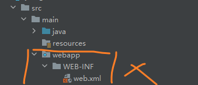
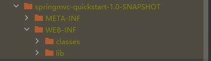
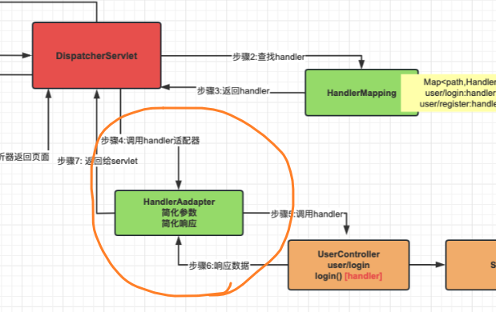
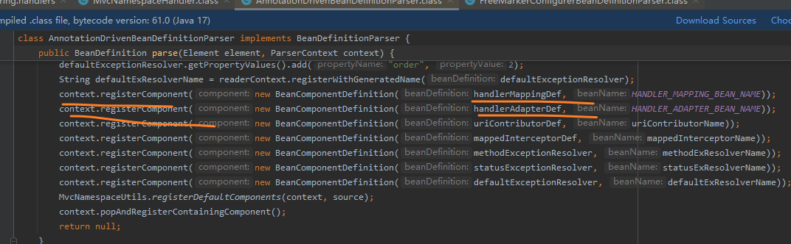
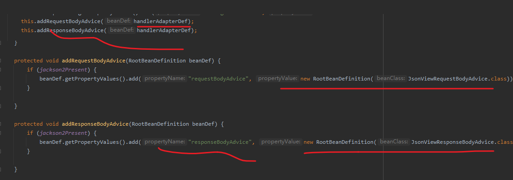
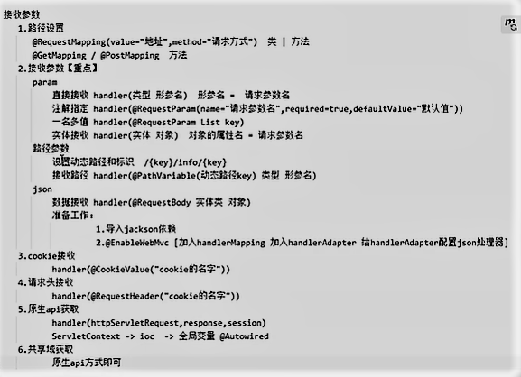
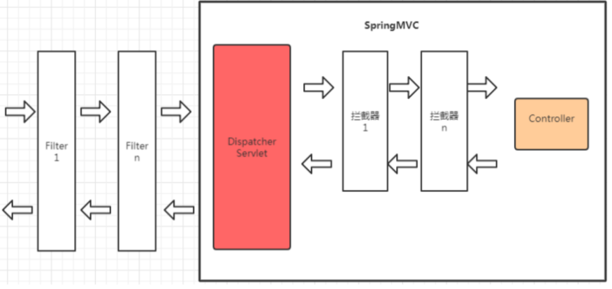
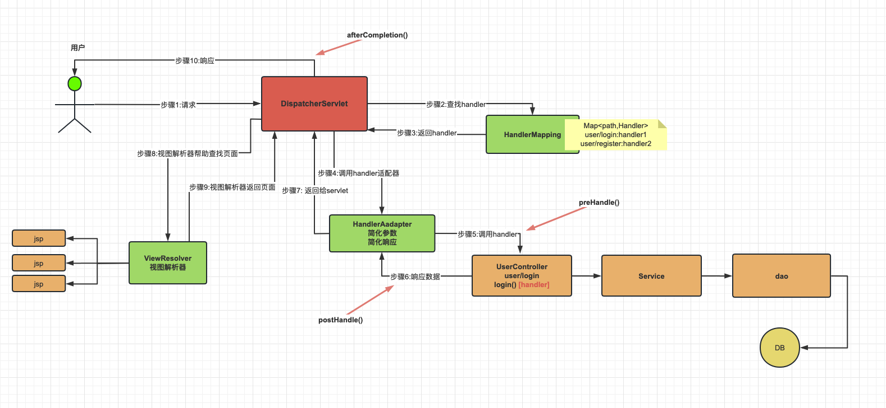

# 简介

此仓库是我学习SpringMVC所创,，参考资料为尚硅谷在B站提供的[课程](https://www.bilibili.com/video/BV1AP411s7D7?p=100) 及 配套的[文档学习资料](https://www.wolai.com/mY4orG21749UeVBHsefaAb)。**建议先略看文档，再听老师讲课**。老师能力很强，讲解十分透彻。

<br>

# SpringMVC总结

## SpringMVC概览

[SpringMVC](https://docs.spring.io/spring-framework/reference/web/webmvc.html)并不是一个单独的框架，实际上它隶属于Spring框架的一部分。其**主要**用于Java Web应用中的控制层(Controller层)：

- **简化前端请求参数**，即规定如何接收来自前台的访问参数，请求体参数，路径参数等，并交由对应的处理器处理；
- **简化后端响应数据**，即(前后端混合模式下)将数据交由视图解析器渲染再行返回，或(前后端分离模式下)**不经**视图解析器，而直接以JSON 数据返回。

<br>


如上来自尚硅谷文档，其阐述了SpringMVC整个框架的工作流程，其中红色和绿色部分的组件，即DispatcherServlet和ViewResolver，HandlerMapping，HandlerAdapter隶属于SpringMVC框架，而橙色部分的组件和右下角的DB则不隶属于SpringMVC框架。

>**SpringMVC相关组件理解**：
>
>    1. DispatcherServlet :  SpringMVC提供，**我们需要使用web.xml配置使其生效**，它是整个流程处理的核心，所有请求都经过它的处理和分发！[ CEO ]
>    2. HandlerMapping :  SpringMVC提供，我们需要进行IoC配置使其加入IoC容器方可生效，它内部缓存handler(controller方法)和handler访问路径数据，被DispatcherServlet调用，用于查找路径对应的handler！[秘书]
>    3. HandlerAdapter : SpringMVC提供，我们需要进行IoC配置使其加入IoC容器方可生效，它可以处理请求参数和处理响应数据数据，每次DispatcherServlet都是通过handlerAdapter间接调用handler，他是handler和DispatcherServlet之间的适配器！[经理]
>    4. Handler : handler又称处理器，**他是Controller类内部的方法简称**，是由我们自己定义，用来接收参数，向后调用业务，最终返回响应结果！[打工人]
>    5. ViewResovler : SpringMVC提供，我们需要进行IoC配置使其加入IoC容器方可生效！视图解析器主要作用简化模版视图页面查找的，但是需要注意，前后端分离项目，后端只返回JSON数据，不返回页面，那就不需要视图解析器！所以，视图解析器，相对其他的组件不是必须的！[财务]

如上是尚硅谷文档对SpringMVC相关组件的阐述。**这里稍微做几点补充**：

1.DispatcherServlet可以通过web.xml配置生效，**但在SpringMVC中，我们通常单独写一个`AbstractAnnotationConfigDispatcherServletInitializer`的子类去替代web.xml**

```java
package com.lordbao.config;

import org.springframework.web.servlet.support.AbstractAnnotationConfigDispatcherServletInitializer;

/**
 * @Author Lord_Bao
 * @Date 2024/8/5 12:02
 * @Version 1.0
 *
 *  AbstractAnnotationConfigDispatcherServletInitializer是 SpringMVC 提供的一个类，我们可以写一个子类并在该子类进行适当的配置，
 *  其效果可以完全替代web.xml，更方便实现完全注解方式ssm处理!
 *  1.通过getRootConfigClasses()方法 指定 service/mapper层的配置类，这些配置类涉及的组件将由一个叫做 AnnotationConfigWebApplicationContext
 *  的容器管理. 通俗来讲，这里配置的组件就是我们之前在学习Spring框架时涉及的组件.
 *  2.通过getServletConfigClasses()方法 指定SpringMVC 相关的配置类，比如配置HandlerMapping,HandlerAdapter,ViewResolver等，
 *  这些组件 又 单独由另外一个 AnnotationConfigWebApplicationContext 容器管理.
 *  两个容器管理不同的组件本质还是为了区分方便，可查看AbstractAnnotationConfigDispatcherServletInitializer的原码来验证双容器管理.
 *
 *  3.getServletMappings 用于配置DispatcherServlet的处理路径，我们一般都设置为 /，这表示dispatcherServlet 将处理所有请求.
 *  如果你学过JavaWeb，将dispatcherServlet 理解为普通的Servlet就行，而Servlet都是要设置相应的请求路径的.
 */

public class SpringMVCInitConfig  extends AbstractAnnotationConfigDispatcherServletInitializer {

    /**
     * 指定service / mapper层的配置类. 在学习SpringMVC的过程中，我们不引入service 和 mapper.
     * 故而这里暂时未用.
     */
    @Override
    protected Class<?>[] getRootConfigClasses() {
        return new Class[0];
    }

    /**
     * 指定springmvc的配置类，在该配置类中，可以配置HandlerMapping,HandlerAdapter,ViewResolver
     */
    @Override
    protected Class<?>[] getServletConfigClasses() {
        return new Class[]{SpringMVCConfig.class};
    }

    /**
     * 设置dispatcherServlet的处理路径!
     * 一般情况下为 / 代表处理所有请求!
     */
    @Override
    protected String[] getServletMappings() {
        return new String[]{"/"};
    }
}
```

也就是说有了上述类之后，你就可以忽略web.xml，甚至可以在项目中无需声明webapp目录结构，



而在pom.xml 中 添上一句`<packaging>war</packaging>`即可，最终仍然会生成下述不含web.xml的文件



当然，**最好还是保存webapp目录结构**，因为在某些情况下(比如混合开发模式)你可能在webapp下存放其他资源等等，**这里的核心是web.xml 可以被 `AbstractAnnotationConfigDispatcherServletInitializer`的子类替代**。

web.xml 主要是用来配置Servlet的映射路径等等，DispatcherServlet用于处理所有的请求的路径也是需要配置的，不过我们不在web.xml中配置，而是在上述类的`getServletMappings`中进行配置，一般而言，都是设置"/"，表示处理所有请求。

<br>

2.handler并不是组件，实际上它是你在Controller中写的方法，比如addUser，deleteUser等等。

3.HandlerMapping，HandlerAdapter,ViewResolver  组件是有关SpringMVC的配置，我们会在单独一个配置类进行配置，见下文的SpringMVC核心代码。这里稍微讲一下HandlerAdapter



在上述图示中，貌似我们不需要HandlerAdapter，DispatcherServlet直接调用相关的handler不就完了嘛。在不看源码的情况下，大概可以猜出这些原因：1 通过HandlerAdapter 去调用handler 可以使得 DispatcherServlet的功能不那么臃肿；2 DispatcherServlet在设计初始，便不能直接调用handler，从命名上看我们知道这里应该是用了适配器模式，而适配器模式的作用就是当两个接口不兼容时，作为中间调和的作用，比如我们的电源适配器就使得220V的家用电压和你的电子设备电压能够相互转换。这样说并不直观，我们还是举一下适配器模式的例子，**假设Client类的代码如下**

```java
public Client{
    
    public void useTools(Tool tool){
        tool.work();
    }
}
```

但是我们想用下面`Facility`的`do`方法

```java
public Facility{
    public void do(){
        //.....
    }
}
```

这该怎么办呢？Client 并不能 直接调用，**这时候就需要适配器**

```java
public ToolAdapter implements Tool{
	private Facility facility;
    
    public ToolAdapter(Facility facility){
        this.facility=facility;
    }
    
    public void work(){
        facility.do();
    }
}
```

这样的话，Client的一个实体client 就可以通过`client.useTools(new ToolAdapter(new Facility()))`来间接调用Facility的do方法。

<br>

## SpringMVC核心代码

**首先**是一个继承自`AbstractAnnotationConfigDispatcherServletInitializer`的子类。

```java
package com.lordbao.config;

import org.springframework.web.servlet.support.AbstractAnnotationConfigDispatcherServletInitializer;

/**
 * @Author Lord_Bao
 * @Date 2024/8/5 12:02
 * @Version 1.0
 *
 *  AbstractAnnotationConfigDispatcherServletInitializer是 SpringMVC 提供的一个类，我们可以写一个子类并在该子类进行适当的配置，
 *  其效果可以完全替代web.xml，更方便实现完全注解方式ssm处理!
 *  1.通过getRootConfigClasses()方法 指定 service/mapper层的配置类，这些配置类涉及的组件将由一个叫做 AnnotationConfigWebApplicationContext
 *  的容器管理. 通俗来讲，这里配置的组件就是我们之前在学习Spring框架时涉及的组件.
 *  2.通过getServletConfigClasses()方法 指定SpringMVC 相关的配置类，比如配置HandlerMapping,HandlerAdapter,ViewResolver等，
 *  这些组件 又 单独由另外一个 AnnotationConfigWebApplicationContext 容器管理.
 *  两个容器管理不同的组件本质还是为了区分方便，可查看AbstractAnnotationConfigDispatcherServletInitializer的原码来验证双容器管理.
 *
 *  3.getServletMappings 用于配置DispatcherServlet的处理路径，我们一般都设置为 /，这表示dispatcherServlet 将处理所有请求.
 *  如果你学过JavaWeb，将dispatcherServlet 理解为普通的Servlet就行，而Servlet都是要设置相应的请求路径的.
 */

public class SpringMVCInitConfig  extends AbstractAnnotationConfigDispatcherServletInitializer {

    /**
     * 指定service / mapper层的配置类. 在学习SpringMVC的过程中，我们不引入service 和 mapper.
     * 故而这里暂时未用.
     */
    @Override
    protected Class<?>[] getRootConfigClasses() {
        return new Class[0];
    }

    /**
     * 指定springmvc的配置类，在该配置类中，可以配置HandlerMapping,HandlerAdapter,ViewResolver
     */
    @Override
    protected Class<?>[] getServletConfigClasses() {
        return new Class[]{SpringMVCConfig.class};
    }

    /**
     * 设置dispatcherServlet的处理路径!
     * 一般情况下为 / 代表处理所有请求!
     */
    @Override
    protected String[] getServletMappings() {
        return new String[]{"/"};
    }
}
```

该子类的三个作用，上面已经阐述得非常详细了，简单来说一个SpringMVC应用

1. 要配置service/mapper 这类组件的配置类，这些组件专门放到一个容器中管理；
2. 要配置SpringMVC 相关组件的配置类，这些组件是HandlerMapping,HandlerAdapter,ViewResolver,Interceptor等，它们又专门放到一个容器中管理；
3. 配置DispatcherServlet的映射路径，我们一般设置为 “/”，表示能够处理所有请求。

上面两个容器都是Spring容器，用于管理不同的组件，分为两个容器主要是为了管理方便。实际上还有一个容器，即Servlet容器，其负责处理 HTTP 请求和响应，并将其分发到相应的 Servlet，在SpringMVC中，实际上这里的Servlet就是DispatcherServlet，我们使用的Tomcat 就是 一个Servlet容器。

<br>

**其次是SpringMVC的配置类**

```java
@Configuration
@ComponentScan("com.lordbao.controller")
public class SpringMVCConfig {

    @Bean
    public RequestMappingHandlerMapping handlerMapping(){
        return  new RequestMappingHandlerMapping();
    }

    @Bean
    public RequestMappingHandlerAdapter handlerAdapter(){
        return new RequestMappingHandlerAdapter();
    }
}
```

这是我们最开始的配置类，和我们在Spring中学到的没什么不同，上面注册两个Bean，即handlerMapping 和 handlerAdapter，**须知这两个组件是必须注册的**。其他的ViewResolver在前后端分离时并非必须，而其他的Interceptor也不是必须的。

**后来我们将SpringMVC的配置类改为了如下**

```java
@EnableWebMvc
@Configuration
@ComponentScan("com.lordbao.controller")
public class SpringMVCConfig {
}
```

在SpringMVC接收数据一章中(详细细节见那里的笔记)，曾谈到`@EnableWebMvc`的效果等价于在XML配置中声明``<mvc:annotation-driven>` `，而该声明与如下代码相关



**即自动注册了handlerMapping 和 handlerAdapter**。



**此外，还给HandlerAdapter添加了JSON相关的Advice，这简化了对JSON数据的处理**：在pom.xml中导入JSON相关依赖，并在接收JSON数据时采用`@RequestBody`，返回JSON数据时采用`@ResponseBody`即可。在前面JavaWeb阶段，处理JSON数据就比较麻烦，首先接收数据时要按照Content-type是不是“application/json”，然后再将JSON 字符串转为 对象 ；其次响应数据时也有设置Content-type为“application/json”，再将对象转为 JSON字符串，实际上这些都不是我们的核心业务，根据AOP的思想，我们应该把它们当做是切面，上述HandlerAdapter添加JSON相关Advice就是这一思想的体现。

<br>

**再后来我们将SpringMVC的配置类改为了如下**

```java
@Configuration
@ComponentScan("com.lordbao.controller")
@EnableWebMvc
public class SpringMVCConfig implements WebMvcConfigurer {


    /**
     * Configure View Resolver.
     * Here we only take jsp  for example, other templates like thymeleaf
     * work alike.
     * The prefix is  /WEB-INF/views/, the suffix is .jsp, so when you visit index,
     * the view resolver will concatenate it into  /WEB-INF/views/index.jsp.
     */
    @Override
    public void configureViewResolvers(ViewResolverRegistry registry) {
        registry.jsp("/WEB-INF/views/",".jsp");
    }

    /**
     * configure Default Servlet Handling.
     * If you want to visit static resources in your project, you need to add
     * the code below.
     * The request process is as follows:
     * first the DispatcherServlet will send the request to the HandlerMapping,
     * then HandlerMapping will check if there is a handler to deal with this
     * request, if not , the HandlerMapping will ask the DefaultServletHandler to
     * handle this request.
     *
     * NOTE that if you want the DefaultServletHandler to work ,you need to add the code
     * below, or HandlerMapping find no handler and report 404 error.
     *
     */
    @Override
    public void configureDefaultServletHandling(DefaultServletHandlerConfigurer configurer) {
        configurer.enable();
    }
}

```

我们写的SpringMVC配置类实现接口`WebMvcConfigurer`，通过重写它的方法来

1. 配置视图解析器(ViewResolver)，比如简化jsp的解析；
2. 配置DefaultServletHandler，在Spring MVC 配置中启用 `DefaultServletHandler` 时，Spring MVC 会将`DispatcherServlet`未匹配到的请求交给 Tomcat 的 `DefaultServlet` 来处理。`DefaultServlet`处理的是静态资源，并且路径一般是根路径“/"；
3. 配置资源处理器，`DefaultServlet`处理静态资源默认以"/"为根路径，你可以通过`addResourceHandlers` 方法来添加自定义的资源处理路径；
4. 配置拦截器(Interceptor)来对请求进行处理，比如权限验证，参数处理等等；
5. 其他SpringMVC组件...

<br>

**最后是关于service 和 mapper的配置类**，它们实际上就是普通的配置类，在Spring中已有提及，这里暂且不表。

<br>

## SpringMVC接收数据

这一节直接参见老师的总结即可



这些东西细节忘了没关系，做好笔记以供查阅即可。

<br>

需要注意的是，要在pom.xml添加下面代码，表示编译器在编译时将参数带上，这样框架在进行反射时才不出现问题

```xml
<properties>
    <maven.compiler.parameters>true</maven.compiler.parameters>
</properties>
```

如若不然，则很可能出现如下错误：

> java.lang.IllegalArgumentException: Name for argument of type [java.util.List] not specified, and parameter name information not available via reflection. Ensure that the compiler uses the '-parameters' flag

<br>

## SpringMVC响应数据

SpringMVC响应数据一节，主要学了3个内容：

1. 前后端混合模式下，配置视图解析器；
2. 前后端分离模式下，如何接收JSON数据(@RequestBody)和响应JSON数据(@ResponseBody);
3. 配置DefaultServletHandler 来 处理静态资源

<br>

## RESTFul 风格实践

RESTFul 就是指导我们怎么去设计HTTP的API接口，比如我们在设计adduser，finduserById，updateUser，deleteUser接口时参数名词化，即路径设置为`/user`,`/user/{id}`,`/user`,`/user/{id}`，方法设置为post，get，put，delete。RESTFul 风格将与`@PathVariable`注解联系起来。

下面来自尚硅谷的内容

**接口设计**

|          |                  |                               |              |
| -------- | ---------------- | ----------------------------- | ------------ |
| 功能     | 接口和请求方式   | 请求参数                      | 返回值       |
| 分页查询 | GET  /user       | page=1&size=10                | { 响应数据 } |
| 用户添加 | POST /user       | { user 数据 }                 | {响应数据}   |
| 用户详情 | GET /user/1      | 路径参数                      | {响应数据}   |
| 用户更新 | PUT /user        | { user 更新数据}              | {响应数据}   |
| 用户删除 | DELETE /user/1   | 路径参数                      | {响应数据}   |
| 条件模糊 | GET /user/search | page=1&size=10&keywork=关键字 | {响应数据}   |

**问题讨论**

为什么查询用户详情，就使用路径传递参数，多条件模糊查询，就使用请求参数传递？

误区：**restful风格下，不是所有请求参数都是路径传递！可以使用其他方式传递**！

在 RESTful API 的设计中，路径和请求参数和请求体都是用来向服务器传递信息的方式。

- 对于查询用户详情，**使用路径传递参数是因为这是一个单一资源的查询，即查询一条用户记录**。使用路径参数可以明确指定所请求的资源，便于服务器定位并返回对应的资源，也符合 RESTful 风格的要求。
- 而对于**多条件模糊查询**，**使用请求参数传递参数是因为这是一个资源集合的查询，即查询多条用户记录**。使用请求参数可以通过组合不同参数来限制查询结果，路径参数的组合和排列可能会很多，不**如使用请求参数更加灵活和简洁**。

**此外，还有一些通用的原则可以遵循**：

- <span style="color:#9B5DE5">路径参数应该用于指定资源的唯一标识或者 ID，而请求参数应该用于指定查询条件或者操作参数</span>。
- 请求参数应该限制在 10 个以内，过多的请求参数可能导致接口难以维护和使用。
- 对于敏感信息，最好使用 POST 和请求体来传递参数。

<br>

## SpringMVC高级特性

本节主要阐述了3个内容

1. 全局异常处理机制(AOP体现)
2. 拦截器
3. 参数校验

**过滤器(Filter)和拦截器(Interceptor)的差别，见下面尚硅谷的介绍**

**相似点**

- 拦截：必须先把请求拦住，才能执行后续操作
- 过滤：拦截器或过滤器存在的意义就是对请求进行统一处理
- 放行：对请求执行了必要操作后，放请求过去，让它访问原本想要访问的资源

**不同点**

- 工作平台不同
    - 过滤器工作在 Servlet 容器中
    - 拦截器工作在 SpringMVC 的基础上
- 拦截的范围
    - 过滤器：能够拦截到的最大范围是整个 Web 应用
    - 拦截器：能够拦截到的最大范围是整个 SpringMVC 负责的请求
- IOC 容器支持
    - 过滤器：想得到 IOC 容器需要调用专门的工具方法，是间接的
    - 拦截器：它自己就在 IOC 容器中，所以可以直接从 IOC 容器中装配组件，也就是可以直接得到 IOC 容器的支持



**功能需要如果用 SpringMVC 的拦截器能够实现，就不使用过滤器**。

拦截器方法拦截位置：



<br>

# SpringMVC学习顺序

- 入门：springmvc-quickstart
- 接收数据：springmvc-receive-data
- 响应数据：springmvc-response-data
- RESTFul实践：springmvc-restful
- 高级特性：springmvc-advanced-features

